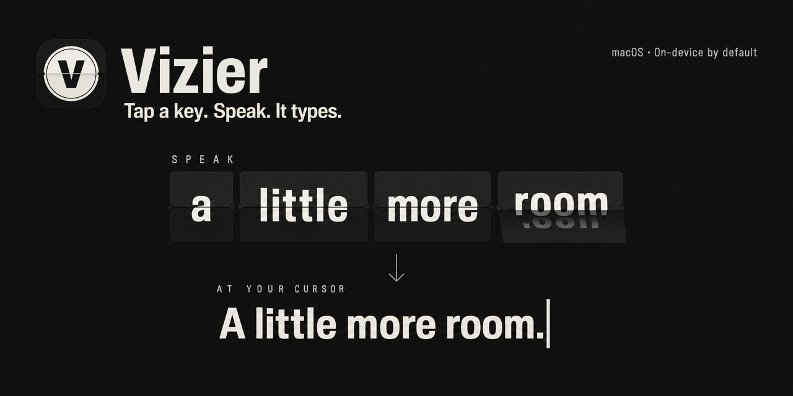
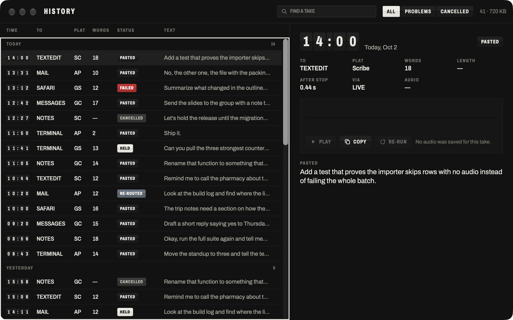
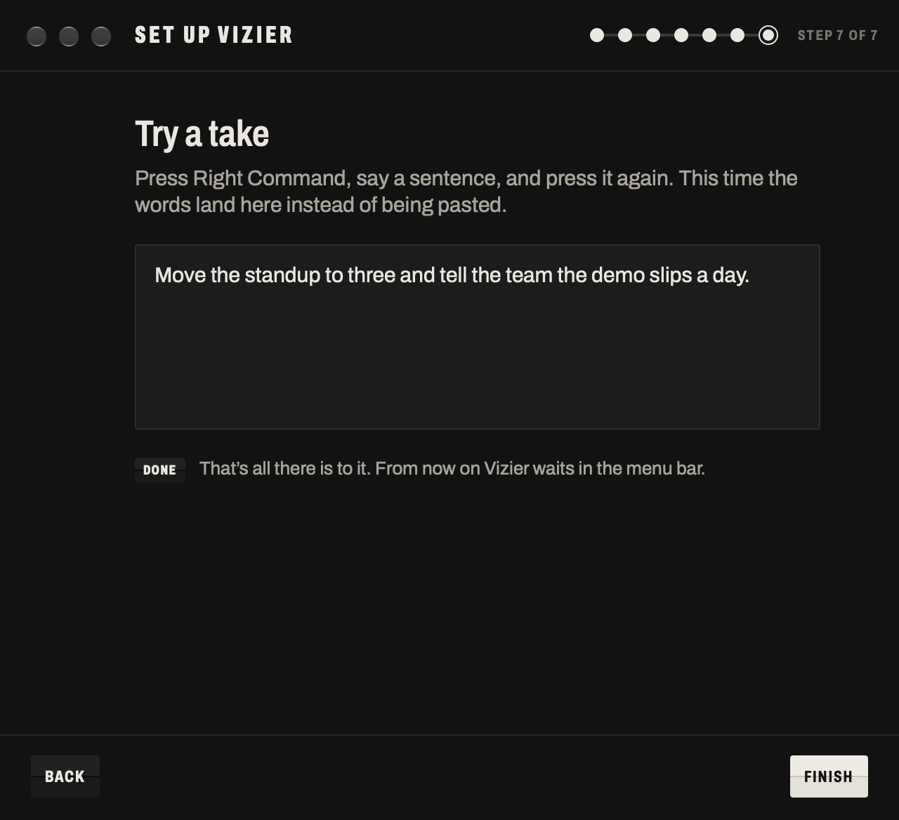

<p align="center">
  
</p>

# Vizier

Vizier is a dictation app for macOS and Linux. Tap a key, talk, tap again, and clean text is pasted where your cursor is.

- **macOS 27 or later, Apple Silicon:** a menu-bar app with a recording strip, a History window and Settings.
- **Linux (x86_64):** a background daemon and the `vizier` command, with no window; `.deb` and AppImage packages. It is tested on X11 and Sway, and uses the desktop portal for GNOME and KDE. The portal flows have been tested against a mock, not yet on a real GNOME or KDE session. See [docs/linux.md](docs/linux.md).


On the Mac it lives in the menu bar. A small strip at the bottom of the screen shows what it hears while you talk, and a History window keeps every take, with its audio, so you can look back or run it through a different mode.



On the Mac, the default mode, Apple, runs entirely on your Mac and needs no account. On Linux, the default mode, local, sends audio to a whisper.cpp server on your own machine. Cloud modes (ElevenLabs Scribe, Google Gemini) are optional on both and use keys you provide.

## Install

### macOS

1. Download the `Vizier-x.y.z.dmg` file (for example `Vizier-0.1.0.dmg`) from the [latest GitHub release](https://github.com/treygoff24/vizier/releases/latest).
2. Open it and drag Vizier to Applications.
3. Open Vizier and follow the setup guide.

Requirements: macOS 27 or later on Apple Silicon. Vizier runs from the menu bar and has no Dock icon unless a window is open or you turn on Show in Dock.

### Linux

From the [release page](https://github.com/treygoff24/vizier/releases/latest), download one of these (for example for 0.2.0):

- `vizier_0.2.0_amd64.deb`, then `sudo apt install ./vizier_0.2.0_amd64.deb` on Debian or Ubuntu.
- `Vizier-0.2.0-x86_64.AppImage`: `chmod +x` it and run it with the same arguments as the `vizier` command, for example `./Vizier-0.2.0-x86_64.AppImage setup`.

Then, in a terminal inside your desktop session, run `vizier setup` (the AppImage form above for an AppImage). It checks your desktop, microphone, paste tools and hotkey, and tells you what to install. Requirements, hotkeys per desktop, and local mode: [docs/linux.md](docs/linux.md).

On the Mac, setup itself is quick and needs no account, plus a one-time download of Apple's speech model whose time depends on your connection. It asks for Microphone access, Accessibility access (so Vizier can paste into other apps), Apple's speech model for your system language, your hotkey, an optional cloud key, and a practice take. Every step can be skipped and revisited later. The first time you run a copy from `/Applications` or `~/Applications`, Open at Login turns on; you can turn it off in Settings › General.



Details: [docs/installing.md](docs/installing.md).

## Use it

On the Mac:

- Tap **Right Command** to start a take. Tap it again to stop. The text is pasted into the app you were using.
- Press **Escape** while recording to cancel the take.
- Right Option and Right Control are available as the hotkey in Settings › General.
- Click the menu bar icon to switch modes, see recent takes, and open History or Settings.

Details, including the command-line flags the app binary accepts: [docs/using.md](docs/using.md).

On Linux there is no menu bar or Escape key: press your hotkey (Ctrl+Alt+Space by default, or a bind you set in your compositor) to start and stop a take, and `vizier last` prints the last take's text. See [docs/linux.md](docs/linux.md) and [docs/cli.md](docs/cli.md).

## Modes

| Mode | Where it runs | Needs a key |
|---|---|---|
| Apple (default on the Mac) | On your Mac, with Apple's speech recognizer | No |
| Local (default on Linux) | A whisper.cpp server on your machine | No |
| Scribe | ElevenLabs Scribe, in the cloud | ElevenLabs key |
| Gemini Clean, Gemini SMART | Google Gemini, in the cloud | Gemini key |

A new install sets every starter mode to your Mac's system language. Apple's on-device speech does not cover every language; if yours is not covered, Settings says Unsupported and points you to Scribe or Gemini. Modes are defined in `~/.config/vizier/vizier.jsonc`, so you can edit them, add your own, or combine engines. [docs/modes-and-config.md](docs/modes-and-config.md) lists every setting (it also covers an experimental, unsupported local Whisper engine), and [docs/vocabulary-and-replacements.md](docs/vocabulary-and-replacements.md) covers teaching Vizier your words.

## Privacy

Apple mode sends nothing off your Mac. Cloud modes send your audio (and the vocabulary list as hints) to the provider you chose; Gemini Clean also sends the transcript text to Google. What a provider then does with it is set by its terms, which bind you as its customer once you add your own key: on Google's unpaid Gemini tier, content may be used to improve its products and read by human reviewers, and ElevenLabs may use content to improve its services unless you opt out in your account. Mac release builds also contact github.com to check for updates. Every take's audio and text is kept on your computer, your keys are kept in the macOS Keychain (on Linux, in the Secret Service keyring or a private file), and Vizier does not write what you say to logs. The full account, with sources, is in [docs/privacy.md](docs/privacy.md).

## Updates

On the Mac, release builds update themselves through Sparkle. Check for updates is in the menu bar popover. A copy you build yourself is signed ad hoc and never updates itself; see [docs/installing.md](docs/installing.md#updates). On Linux, download the new package from the release page.

## Troubleshooting

The common problems are a lost Accessibility grant, a missing Apple speech model, and text that is held on the clipboard instead of pasted. [docs/troubleshooting.md](docs/troubleshooting.md) covers these and the strip's status messages. On Linux, run `vizier doctor`; [docs/linux.md](docs/linux.md#troubleshooting) explains each check.

## Build from source

On the Mac you need macOS 27 or later on Apple Silicon, and Xcode 27 or later (Swift 6.2+).

```bash
swift build
swift test
scripts/build-app.sh      # produces build/Vizier.app, signed ad hoc
open build/Vizier.app
```

On Linux you need Swift 6.4 (installed with [swiftly](https://www.swift.org/install/linux/)). `swift build -c release --product vizier` produces `.build/release/vizier`. `scripts/linux/ci.sh` runs the Linux build and tests in a clean Docker container.

[docs/building.md](docs/building.md) explains signing, the install script, the Linux packages, and how a release is made. [CONTRIBUTING.md](CONTRIBUTING.md) has the contribution rules. To report a vulnerability, see [SECURITY.md](SECURITY.md).

## Documentation

[docs/README.md](docs/README.md) is the index: installing, using, modes and configuration, vocabulary and replacements, privacy, troubleshooting, building, architecture, and a guide for AI agents.

## Contributing and support

Questions: [Discussions](https://github.com/treygoff24/vizier/discussions). Bugs and feature requests: the [issue forms](https://github.com/treygoff24/vizier/issues/new/choose); see [SUPPORT.md](SUPPORT.md). Code: [CONTRIBUTING.md](CONTRIBUTING.md). Security: [SECURITY.md](SECURITY.md). Everyone follows the [Code of Conduct](CODE_OF_CONDUCT.md).

## License and credits

Vizier is licensed under the GNU General Public License, version 3 only (GPL-3.0-only); see [LICENSE](LICENSE). It is "only" rather than "or later" because it includes code adapted from [VoiceInk](https://github.com/Beingpax/VoiceInk), which is licensed under GPLv3. The source for each release is the matching tag `vX.Y.Z` in this repository (for example `v0.1.0`).

Parts of Vizier, including audio capture, the shortcut handling and the paste code, are adapted from VoiceInk. The Archivo font is under the SIL Open Font License, and updates use [Sparkle](https://sparkle-project.org), under its own license. See [NOTICE](NOTICE) for attributions and [THIRD-PARTY-LICENSES](THIRD-PARTY-LICENSES) for the full license texts.

Vizier is not affiliated with or endorsed by Apple, Google, ElevenLabs or VoiceInk.

## For AI agents

Read [CLAUDE.md](CLAUDE.md) first; it holds the rules for working in this repository. [docs/agents.md](docs/agents.md) has the working guide, and [docs/architecture.md](docs/architecture.md) explains how a take flows through the code.

**Repo map**

| Path | What is there |
|---|---|
| `Sources/VizierEngine/` | The engine library, no UI, built on both OSes: config, capture, transcribers, cleanup, replacements, paste targeting, hotkey logic, the take session, take storage and history |
| `Sources/Vizier/` | The app executable (AppKit and SwiftUI): menu bar, strip, History, Settings, onboarding, take controller, updater, command-line flags |
| `Sources/VizierCLI/`, `Sources/vizier-linux/` | The Linux daemon and `vizier` command, and its desktop adapters |
| `Tests/VizierEngineTests/`, `Tests/VizierCLITests/` | Engine and Linux CLI tests (Swift Testing) |
| `Tests/VizierTests/` | App-level tests: settings, windows, login item, Dock policy, real-data guard |
| `Resources/` | `Info.plist`, icon, Archivo font, sound cues |
| `scripts/` | `build-app.sh`, `install.sh`, `release.sh`, `local-models.sh`, `make-icon.swift`; `scripts/linux/` for Linux CI and packaging |
| `VERSION` | `MARKETING_VERSION` and `BUILD_NUMBER`; the build number only goes up |
| `DESIGN.md` | The visual design system |

**Build and test**

```bash
swift build
swift test                                   # or: swift test --filter <TestName>
scripts/build-app.sh                         # build/Vizier.app, ad hoc signed
build/Vizier.app/Contents/MacOS/Vizier --version
scripts/linux/ci.sh                          # Linux only (needs Docker): build and test in a clean container
```

Do not run `scripts/install.sh`, and do not quit or relaunch an installed Vizier, unless the person you work for asks: it replaces and restarts their dictation tool.

**Config format and location**

`~/.config/vizier/vizier.jsonc` is JSON5 (comments and trailing commas allowed) with snake_case keys, re-read on every take. Next to it are `vocabulary.txt` and `replacements.txt`. Takes are in `~/Library/Application Support/Vizier/`. Read the format in [docs/modes-and-config.md](docs/modes-and-config.md), and the code that defines it in `Sources/VizierEngine/Config/VizierConfig.swift`. Do not read the folders that hold a user's real takes, vocabulary or replacements.

**Conventions**

- No real dictations, audio, vocabulary or replacements in commits, tests, issues or logs. Test audio is synthetic (`say -o x.aiff "text"`, then `afconvert`).
- Prove every new test by breaking the code it guards and watching it fail.
- Commit with explicit paths, never `git add -A` or `git add .`. Subject line of 72 characters or fewer, then a blank line and the reason.
- Never print or commit API keys.

**Links into the docs:** [installing](docs/installing.md) · [using](docs/using.md) · [modes and config](docs/modes-and-config.md) · [vocabulary and replacements](docs/vocabulary-and-replacements.md) · [privacy](docs/privacy.md) · [troubleshooting](docs/troubleshooting.md) · [building](docs/building.md) · [architecture](docs/architecture.md) · [agents](docs/agents.md) · [support](SUPPORT.md) · [code of conduct](CODE_OF_CONDUCT.md)
